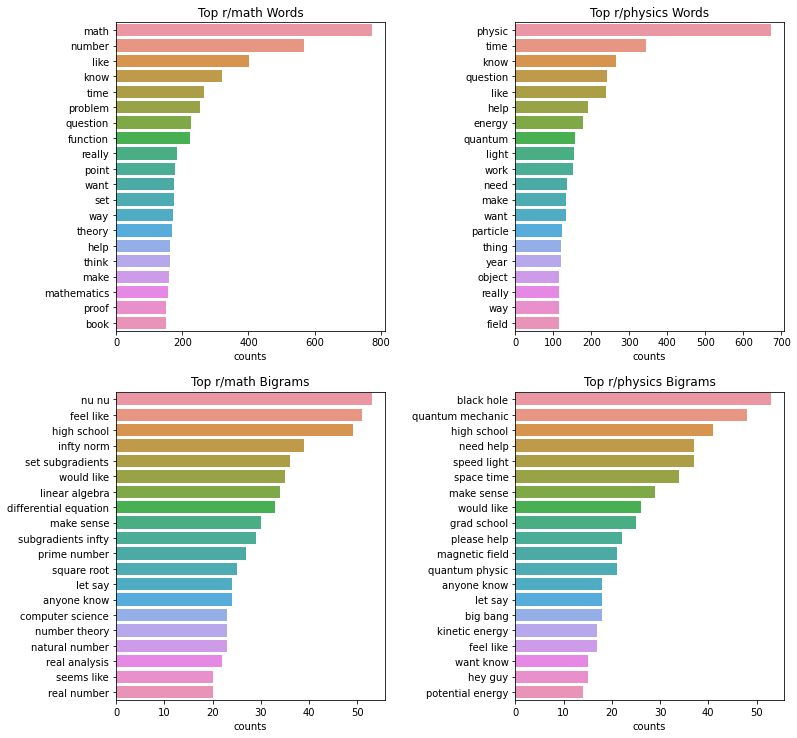
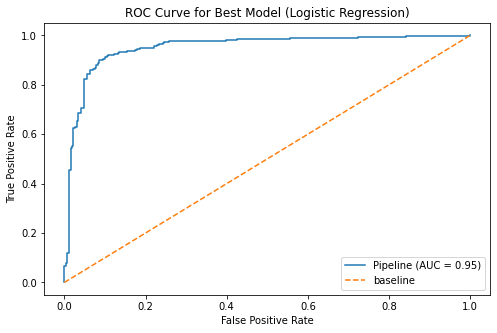
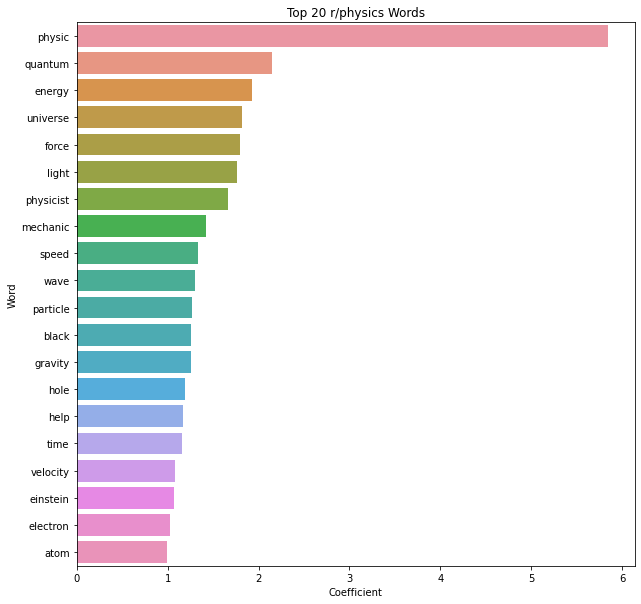
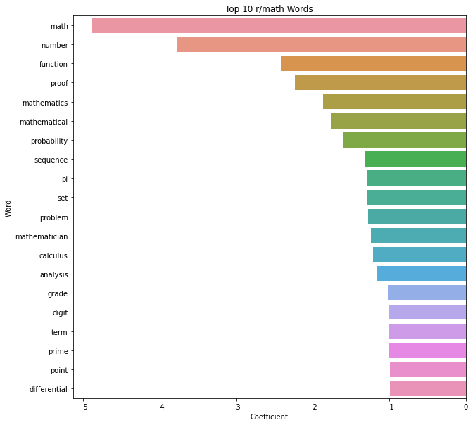
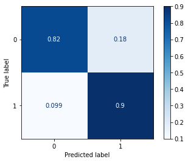

### Problem Statement
Mathematics and physics are interconnected disciplines, with a long, rich history of co-development and evolution, and it is often stated that math is the language of physics. However, in this project we want to investigate the similarities and differences between the everyday language used around each subject.
More specifically: Based on its text alone, how accurately can we predict if a given post came from the [r/math](www.reddit.com/r/math) or [r/physics](www.reddit.com/r/physics) subreddits?
We use natural language processing (NLP) and machine learning techniques to build classification models to try to answer this question.

  We use the [Pushshift API](https://github.com/pushshift/api) to scrape r/math and r/physics, clean and preprocess the text data, and train and tune a variety of classification models to the data. The 10 models considered are: K-Nearest Neighbors, Logistic Regression, Support Vector Machines (SVM), Naive Bayes, Decision Trees, Bagged Decision Trees, Random Forests, AdaBoost Decision Trees, Gradient Boosted Decision Trees, and Extremely Randomized Trees (Extratrees).

  Our primary metric for performance is classification accuracy, though other metrics such as sensitivity, specificity, and precision are also measured.

### Data:
 We were able scrape over 150,000 combined reddit posts from the r/math and r/physics subreddits. Due to computational limitations, much of our analysis was done on a very small subset of 2140 posts 1057 from r/math, and 1083 from r/physics. We only use text data from the post title and body, no pictures/videos or comments are considered.

 Note that only the final combined/cleaned data

### Methodology:
The main data cleaning tasks included:
  - Deleting posts that had been flagged for removal, and 'stickied' posts.
  - Replacing missing text (NaNs) with empty strings.
  - Converting all text to lowercase and removing common stop words.
  - Removing any url links, HTML tags, numbers, and special symbols.

At the end of this process, we combine the data into a single feature `lem_text` which is a combined string containing both the lemmatized tile and body texts.

### EDA:
The most interesting, and potentially relevant, findings in the text data is the most common words appearing in each subreddit. We use sklearn's `CountVectorizer()` to get counts of each word, along with counts for the most common bigrams (two consecutive words).

Bar charts with counts are shown below.

### Data Preprocessing
   - We lemmatize the text using WordNetLemmatizer from the [Natural Language Toolkit](https://www.nltk.org/).
   - Both CountVectorizer and TfidfVectorizer are used to vectorize the text data. We compare the performance of our models as we change vectorization, and look at the effect of including/excluding bigrams.
   - We binarize the subreddit feature so that r/math = 0 and r/physics = 1.

### Modeling:
  After splitting the data into train/test sets, we train each of the 40 vectorizer/model combinations listed above and compare 5-fold cross-validation averages and test scores. The performance of each model/vectorizor combination is shown in the table below (tn = true negatives, tp = true positives, fn = false negatives, fp = false positives):

  |    | model         | vectorizer            |   train_score |   cv_score |   test_score |   tn |   tp |   fn |   fp |
|---:|:--------------|:-----------------|--------------:|-----------:|-------------:|-----:|-----:|-----:|-----:|
|  0 | logreg        | tvec_ngram_(1,2) |      0.993324 |   0.892513 |     0.904984 |  291 |  290 |   35 |   26 |
|  1 | svm           | tvec_ngram_(1,2) |      0.998665 |   0.892508 |     0.903427 |  291 |  289 |   36 |   26 |
|  2 | svm           | tvec_ngram_(1,1) |      0.995995 |   0.892506 |     0.898754 |  286 |  291 |   34 |   31 |
|  3 | logreg        | tvec_ngram_(1,1) |      0.980641 |   0.893846 |     0.895639 |  284 |  291 |   34 |   33 |
|  4 | logreg        | cvec_ngram_(1,1) |      0.992657 |   0.875817 |     0.894081 |  280 |  294 |   31 |   37 |
|  5 | logreg        | cvec_ngram_(1,2) |      0.99733  |   0.865137 |     0.883178 |  270 |  297 |   28 |   47 |
|  6 | nb            | cvec_ngram_(1,1) |      0.966622 |   0.885184 |     0.883178 |  282 |  285 |   40 |   35 |
|  7 | nb            | cvec_ngram_(1,2) |      0.990654 |   0.883862 |     0.880062 |  289 |  276 |   49 |   28 |
|  8 | nb            | tvec_ngram_(1,1) |      0.97263  |   0.868497 |     0.875389 |  295 |  267 |   58 |   22 |
|  9 | nb            | tvec_ngram_(1,2) |      0.99466  |   0.874504 |     0.872274 |  294 |  266 |   59 |   23 |
| 10 | extratree     | tvec_ngram_(1,1) |      0.998665 |   0.853128 |     0.862928 |  274 |  280 |   45 |   43 |
| 11 | randomforest  | tvec_ngram_(1,1) |      0.998665 |   0.846475 |     0.856698 |  265 |  285 |   40 |   52 |
| 12 | extratree     | tvec_ngram_(1,2) |      0.998665 |   0.833779 |     0.842679 |  258 |  283 |   42 |   59 |
| 13 | randomforest  | cvec_ngram_(1,1) |      0.998665 |   0.833106 |     0.842679 |  263 |  278 |   47 |   54 |
| 14 | extratree     | cvec_ngram_(1,1) |      0.998665 |   0.829779 |     0.842679 |  272 |  269 |   56 |   45 |
| 15 | gradientboost | tvec_ngram_(1,1) |      0.911883 |   0.831097 |     0.841121 |  239 |  301 |   24 |   78 |
| 16 | gradientboost | tvec_ngram_(1,2) |      0.917891 |   0.835097 |     0.839564 |  239 |  300 |   25 |   78 |
| 17 | gradientboost | cvec_ngram_(1,1) |      0.903872 |   0.835104 |     0.838006 |  234 |  304 |   21 |   83 |
| 18 | adaboost      | cvec_ngram_(1,2) |      0.998665 |   0.813741 |     0.834891 |  258 |  278 |   47 |   59 |
| 19 | gradientboost | cvec_ngram_(1,2) |      0.905207 |   0.833764 |     0.833333 |  232 |  303 |   22 |   85 |
| 20 | bagging       | cvec_ngram_(1,1) |      0.986649 |   0.808392 |     0.833333 |  256 |  279 |   46 |   61 |
| 21 | bagging       | cvec_ngram_(1,2) |      0.985314 |   0.803037 |     0.833333 |  250 |  285 |   40 |   67 |
| 22 | randomforest  | cvec_ngram_(1,2) |      0.998665 |   0.816412 |     0.831776 |  250 |  284 |   41 |   67 |
| 23 | extratree     | cvec_ngram_(1,2) |      0.998665 |   0.81641  |     0.831776 |  249 |  285 |   40 |   68 |
| 24 | svm           | cvec_ngram_(1,1) |      0.900534 |   0.803057 |     0.831776 |  237 |  297 |   28 |   80 |
| 25 | randomforest  | tvec_ngram_(1,2) |      0.998665 |   0.818415 |     0.830218 |  252 |  281 |   44 |   65 |
| 26 | bagging       | tvec_ngram_(1,1) |      0.985981 |   0.803048 |     0.830218 |  253 |  280 |   45 |   64 |
| 27 | adaboost      | tvec_ngram_(1,1) |      0.998665 |   0.823732 |     0.827103 |  261 |  270 |   55 |   56 |
| 28 | adaboost      | cvec_ngram_(1,1) |      0.998665 |   0.818404 |     0.823988 |  268 |  261 |   64 |   49 |
| 29 | svm           | cvec_ngram_(1,2) |      0.901869 |   0.779023 |     0.820872 |  219 |  308 |   17 |   98 |
| 30 | cart          | cvec_ngram_(1,2) |      0.998665 |   0.807079 |     0.817757 |  250 |  275 |   50 |   67 |
| 31 | cart          | tvec_ngram_(1,1) |      0.998665 |   0.808384 |     0.814642 |  259 |  264 |   61 |   58 |
| 32 | cart          | cvec_ngram_(1,1) |      0.998665 |   0.805059 |     0.808411 |  256 |  263 |   62 |   61 |
| 33 | adaboost      | tvec_ngram_(1,2) |      0.998665 |   0.815735 |     0.806854 |  260 |  258 |   67 |   57 |
| 34 | bagging       | tvec_ngram_(1,2) |      0.987316 |   0.802401 |     0.797508 |  258 |  254 |   71 |   59 |
| 35 | cart          | tvec_ngram_(1,2) |      0.998665 |   0.797035 |     0.794393 |  262 |  248 |   77 |   55 |
| 36 | knn           | tvec_ngram_(1,2) |      0.871162 |   0.818417 |     0.788162 |  214 |  292 |   33 |  103 |
| 37 | knn           | tvec_ngram_(1,1) |      0.875167 |   0.811077 |     0.786604 |  213 |  292 |   33 |  104 |
| 38 | knn           | cvec_ngram_(1,1) |      0.769693 |   0.692225 |     0.696262 |  136 |  311 |   14 |  181 |
| 39 | knn           | cvec_ngram_(1,2) |      0.67223  |   0.586116 |     0.613707 |   72 |  322 |    3 |  245 |

Almost all of the models overfit the data, but seem to generalize fairly well to new, unseen data. LogisticRegression, SVM (with TfidfVectorizer), and Naive Bayes perform the best, with boosted/random tree methods doing next best, and cart/bagging/knn scoring worst.

We decide to prune the list of possible models down the top three above Logistic Regression, SVM, and Naive Bayes along with RandomForest. We pair each of these models with each of the two vectorizers  to give 8 total pipelines. After performing 5-fold cross-validated grid searching, we compare test scores and select the best overall model.

### Results:

|    | name                     |   train_score |   cv_score |   test_score |   sensitivity (TPR) |   specificity (TNR) |   precision |
|---:|:-------------------------|--------------:|-----------:|-------------:|--------------:|--------------:|------------:|
|  0 | svm_tvec_bigrams                |      0.998665 |   0.896504 |     0.898754 |      0.88     |      0.917981 |    0.916667 |
|  1 | logistic_regression_tvec |      0.980641 |   0.893846 |     0.895639 |      0.895385 |      0.895899 |    0.898148 |
|  2 | logistic_regression_cvec |      0.992657 |   0.875817 |     0.894081 |      0.904615 |      0.883281 |    0.888218 |
|  3 | naive_bayes_tvec_bigrams         |      0.996662 |   0.879184 |     0.872274 |      0.827692 |      0.917981 |    0.911864 |
|  4 | svm_cvec_bigrams                 |      0.995995 |   0.857135 |     0.867601 |      0.898462 |      0.835962 |    0.848837 |
|  5 | naive_bayes_cvec_bigrams         |      0.993992 |   0.893197 |     0.864486 |      0.849231 |      0.880126 |    0.878981 |
|  6 | rf_cvec                  |      0.998665 |   0.846462 |     0.864486 |      0.895385 |      0.832808 |    0.84593  |
|  7 | rf_tvec                  |      0.998665 |   0.84579  |     0.853583 |      0.883077 |      0.823344 |    0.836735 |

We see that each of the models are still overfitting the training data, with all achieving over 98% accuracy. However, the cross-validation and test scores are still quite good, around 90% for the best models (SVM with TF-IDF and Bigrams and Logistic Regression with TF-IDF and no bigrams), which is considerably better than the baseline of 50%.

Although SVM scored marginally higher on the test data, we choose Logistic Regression with TfidfVectorizer as our best model due to the better interpretability of the model coefficients.
The ROC-AUC score for this model was 0.96, which is very high, and indicates that our two classes are very well separated by this model. The associated ROC curve is shown below

### Conclusions:
  By examining the coefficients of our best LogisticRegression model, we can gain some insight into which words are most important for classifying r/math vs r/physics posts. The 20 words which had the largest positive coefficients are shown below, since physics was encoded as our positive class, these are the most influential predictors for being a r/physics post:

We see that words like physics, physicist, quantum, energy, universe, force, light, etc increase the probability a post belongs to r/physics.

On the other hand, the most negative coefficients in our logistic regression model are associated to a post being classified as 0 i.e. belonging to r/math.

Again, we see classic terminology associated to math appearing here: math, number, function, proof, pi, etc.

Although math and physics are very closely related disciplines, it is apparent that they do have very separate and distinct technical terms which makes text posts generally quite easy to distinguish.

As a final test, we examine how well our model, which was trained on only 1498 posts, performs on the entire collected dataset of 142410 posts (51.6% math, 48.4% physics). We find that it has an accuracy of 0.858, much better than baseline, and the associated confusion matrix is shown below:

On this large dataset, our model has a sensitivity score of 0.9 and a specificity of 0.82, which indicates it is more accurate at classifying posts from physics than it is for math. This could be due to the fact that physics posts generally have more very specific physics related terms in them, while both math and physics posts contain mathematical terminology. 

### Next Steps:
  - Due to computational limitations, we were unable to use a very large dataset for training and had to limit grid-searching to relatively small parameter ranges. It would be interesting to increase both the training sizes and do more high-resolution grid searches to find more optimal parameters. Even with these crude searches, however, we were able to get fairly good results.
  - It seems math and physics were too easily classified due to the highly specific language used in each separate subject, so it might be more interesting to attempt classifying two subreddits where the overlap in language/jargon is much higher.
  - A possible next step would be to try to apply multi-class classification methods to attempt to classify posts from 3+ different subreddits.
